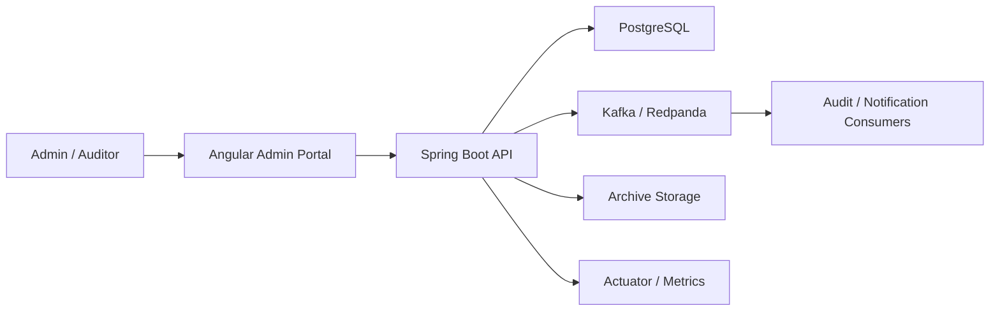
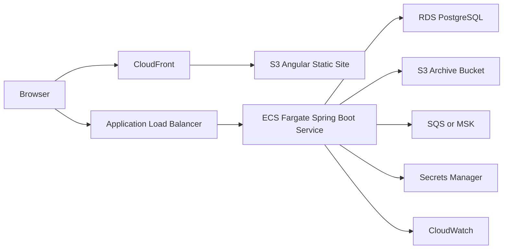

# Architecture

## System Context

The Enterprise Data Governance Platform is an internal admin system. Business users and auditors use the frontend to manage records, policies, imports, and audit history. The backend owns the business rules and persists data in PostgreSQL.

At first, the system runs locally through Docker Compose. Later, the same architecture can be deployed to AWS with managed infrastructure.

## High-Level Components

## Backend Responsibilities

The backend is the source of truth for records, policies, jobs, and audit trails.

Primary modules:

- Authentication: login, JWT creation, roles, and authorization.
- Records: CRUD, search, filtering, pagination, and status transitions.
- Retention policies: policy creation, assignment, and expiration calculation.
- Archive and purge: lifecycle workflows with idempotency checks.
- Audit logs: trace who changed what, when, why, and under which correlation ID.
- ETL jobs: import, validation, transformation, error tracking, and retries.
- Events: publish record lifecycle events and consume them for downstream workflows.
- Observability: health checks, structured logs, metrics, and latency tracking.

## Frontend Responsibilities

The frontend is an Angular admin portal for operational users.

Primary pages:

- Login
- Dashboard
- Records
- Record details
- Retention policies
- ETL jobs
- Audit logs

The frontend should stay focused on presentation, form validation, routing, and user workflow. Business rules remain in the backend.

## Data Storage

PostgreSQL stores relational business data:

- users
- roles
- records
- retention_policies
- archive_jobs
- purge_jobs
- audit_logs
- etl_job_runs
- etl_record_errors
- processed_events

Flyway owns schema evolution. Every database change is versioned, reviewable, and repeatable.

## Event Processing

Kafka or Redpanda is used for asynchronous workflows.

Initial lifecycle events:

- record.created
- record.archived
- record.purged
- etl.record.failed

The platform will use retry and dead-letter handling so failed event processing can be diagnosed without silently losing data.

## Idempotency

Archive, purge, import, and event-consumption workflows must be safe to retry.

Examples:

- A record that is already archived should not create a duplicate archive job.
- A purged record should not be purged twice.
- A consumed event should be stored in `processed_events` so duplicate delivery does not repeat side effects.

This matters because distributed systems often retry operations after timeouts, crashes, or broker redelivery.

## Observability

The platform should answer four production questions:

- Is the service healthy?
- Are requests slow?
- Are jobs failing?
- Which user or correlation ID caused a change?

Initial tools:

- Spring Boot Actuator for health and metrics endpoints.
- Structured application logs.
- Correlation IDs in requests, jobs, events, and audit logs.

Later tools:

- Prometheus and Grafana locally.
- CloudWatch in AWS.

## Cloud Deployment Path

Recommended first cloud architecture:

ECS Fargate is the recommended first deployment target because it demonstrates containerized production deployment without introducing Kubernetes complexity too early. EKS can be added later if orchestration requirements justify it.

## Key Design Decisions

- Start with a modular monolith, not microservices.
- Keep the backend as the source of truth for business rules.
- Use PostgreSQL for strongly consistent core data.
- Use events for asynchronous side effects, not for the primary record transaction.
- Add idempotency before adding retries.
- Use Flyway from the beginning so schema changes are controlled.
- Add observability early enough that debugging is part of the design, not an afterthought.
